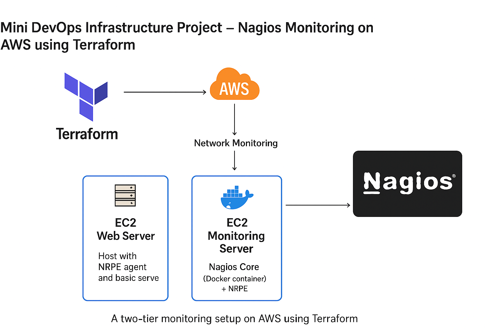
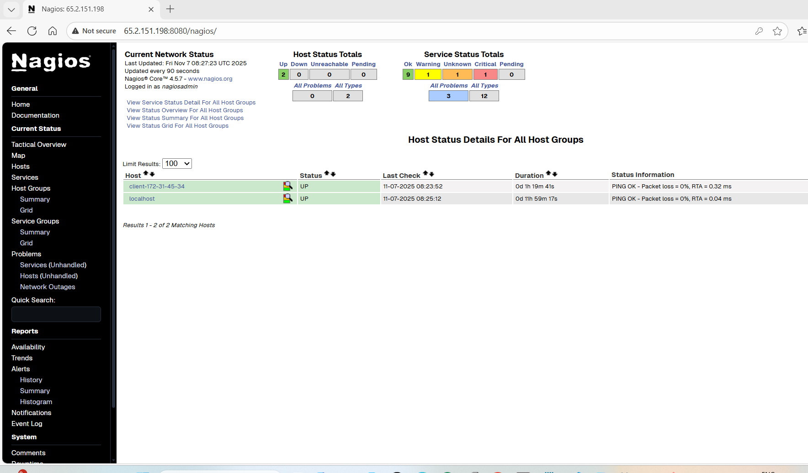
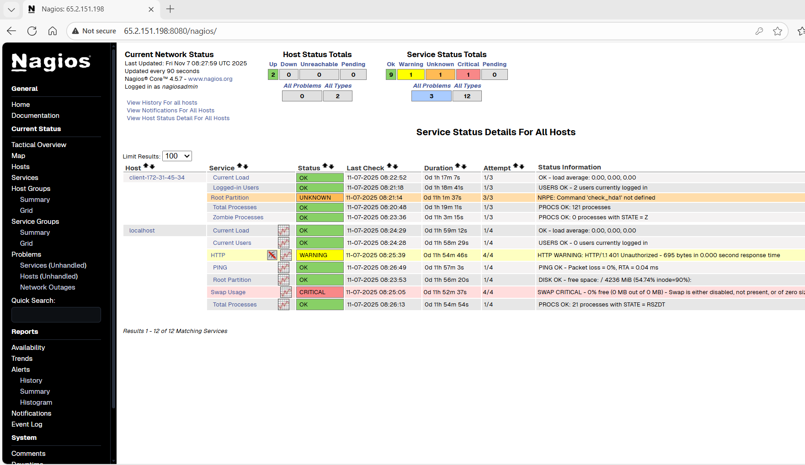

# Mini DevOps Infrastructure Project – Nagios Monitoring on AWS using Terraform

This project provisions a **two-tier monitoring setup on AWS** using **Terraform** and **Nagios**.
It automatically deploys:

* A **Web Server** (monitored node) with NRPE agent
* A **Monitoring Server** running Nagios (inside Docker)

Nagios continuously monitors key health metrics — such as CPU load, users, disk, and processes — across both servers.

---

## Architecture Overview



### Components

| Component                 | Description                                                   |
| ------------------------- | ------------------------------------------------------------- |
| **Terraform**             | Automates AWS resource provisioning                           |
| **EC2 Web Server**        | Host with NRPE agent and basic services                       |
| **EC2 Monitoring Server** | Nagios Core (Docker container) + NRPE                         |
| **Security Group**        | Allows SSH (22), HTTP (80), Nagios UI (8080), and NRPE (5666) |
| **Nagios**                | Monitors Web server health via NRPE checks                    |

---

## Directory Structure

```
Mini-DevOps-Nagios-Terraform/
│
├── main.tf                     # Terraform configuration for AWS resources
├── variables.tf                # Variable definitions (region, AMI, etc.)
├── userdata_web.sh             # Web server bootstrap script
├── userdata_monitoring.tpl     # Monitoring server bootstrap script (with template variables)
│
├── outputs.tf                  # Output public/private IPs
├── terraform.tfvars            # Variable values for Terraform
│
├── architecture.png            # Architecture diagram
├── nagios_hosts.png            # Nagios Hosts Dashboard
├── nagios_services.png         # Nagios Services Dashboard
│
└── README.md                   # Project documentation

```

---

## Infrastructure Deployment Workflow

1. **Initialize Terraform**

   ```bash
   terraform init
   ```

2. **Validate Configuration**

   ```bash
   terraform validate
   ```

3. **Apply Infrastructure**

   ```bash
   terraform apply -auto-approve
   ```

4. **Access Nagios UI**

   * Open: `http://<monitoring_public_ip>:8080/nagios`
   * Login: `nagiosadmin / <default_password>`

5. **Validate NRPE Communication**

   From inside the Nagios container:

   ```bash
   /opt/nagios/libexec/check_nrpe -H <web_private_ip> -c check_load
   ```

---

## Terraform Configuration Explained (`main.tf`)

```hcl
provider "aws" {
  region = var.aws_region
}

# ------------------------------
# Security Group Definition
# ------------------------------
resource "aws_security_group" "monitoring_sg" {
  name        = "monitoring-sg"
  description = "Allow SSH, HTTP, NRPE, and Nagios access"
  vpc_id      = var.vpc_id

  ingress {
    from_port   = 22
    to_port     = 22
    protocol    = "tcp"
    cidr_blocks = ["0.0.0.0/0"]
  }

  ingress {
    from_port   = 80
    to_port     = 80
    protocol    = "tcp"
    cidr_blocks = ["0.0.0.0/0"]
  }

  ingress {
    from_port   = 8080
    to_port     = 8080
    protocol    = "tcp"
    cidr_blocks = ["0.0.0.0/0"]
  }

  ingress {
    from_port   = 5666
    to_port     = 5666
    protocol    = "tcp"
    cidr_blocks = ["172.31.0.0/16"]
  }

  ingress {
    from_port   = -1
    to_port     = -1
    protocol    = "icmp"
    cidr_blocks = ["0.0.0.0/0"]
  }

  egress {
    from_port   = 0
    to_port     = 0
    protocol    = "-1"
    cidr_blocks = ["0.0.0.0/0"]
  }
}

# ------------------------------
# EC2 Instances
# ------------------------------
resource "aws_instance" "monitoring" {
  ami           = var.ami_id
  instance_type = var.instance_type
  subnet_id     = var.subnet_id
  vpc_security_group_ids = [aws_security_group.monitoring_sg.id]
  user_data     = file("userdata_monitoring.tpl")
  tags = {
    Name = "Nagios-Monitoring-Server"
  }
}

resource "aws_instance" "web" {
  ami           = var.ami_id
  instance_type = var.instance_type
  subnet_id     = var.subnet_id
  vpc_security_group_ids = [aws_security_group.monitoring_sg.id]
  user_data     = file("userdata_web.sh")
  tags = {
    Name = "Web-Server"
  }
}
```

---

## User Data Scripts

### **Monitoring Server** (`userdata_monitoring.tpl`)

```bash
#!/bin/bash
set -e
apt-get update -y
apt-get install -y docker.io nagios-nrpe-server nagios-plugins apache2-utils unzip curl
systemctl enable docker && systemctl start docker

docker run -d \
  --name nagios \
  -p 8080:80 \
  -v /opt/nagios/etc:/opt/nagios/etc \
  -v /opt/nagios/var:/opt/nagios/var \
  jasonrivers/nagios

sed -i "s/^allowed_hosts=.*/allowed_hosts=127.0.0.1,172.31.45.34,172.31.0.0\/16/" /etc/nagios/nrpe.cfg
systemctl enable nagios-nrpe-server && systemctl restart nagios-nrpe-server

mkdir -p /opt/nagios/etc/objects
cat > /opt/nagios/etc/objects/client-172-31-45-34.cfg <<EOF
define host {
  use                     linux-server
  host_name               client-172-31-45-34
  alias                   Web Server
  address                 172.31.45.34
}

define service {
  use                     generic-service
  host_name               client-172-31-45-34
  service_description     Current Load
  check_command           check_nrpe!check_load
}
define service {
  use                     generic-service
  host_name               client-172-31-45-34
  service_description     Root Partition
  check_command           check_nrpe!check_hda1
}
define service {
  use                     generic-service
  host_name               client-172-31-45-34
  service_description     Total Processes
  check_command           check_nrpe!check_total_procs
}
define service {
  use                     generic-service
  host_name               client-172-31-45-34
  service_description     Zombie Processes
  check_command           check_nrpe!check_zombie_procs
}
EOF

echo "cfg_file=/opt/nagios/etc/objects/client-172-31-45-34.cfg" >> /opt/nagios/etc/nagios.cfg
docker restart nagios
```

### **Web Server** (`userdata_web.sh`)

```bash
#!/bin/bash
set -e
apt-get update -y
apt-get install -y nagios-nrpe-server nagios-plugins unzip curl

monitoring_ip="172.31.44.22"
sed -i "s/^allowed_hosts=.*/allowed_hosts=127.0.0.1,${monitoring_ip}/" /etc/nagios/nrpe.cfg

cat <<EOF > /etc/nagios/nrpe_local.cfg
command[check_users]=/usr/lib/nagios/plugins/check_users -w 5 -c 10
command[check_load]=/usr/lib/nagios/plugins/check_load -w 5.0,4.0,3.0 -c 10.0,6.0,4.0
command[check_hda1]=/usr/lib/nagios/plugins/check_disk -w 20% -c 10% -p /
command[check_total_procs]=/usr/lib/nagios/plugins/check_procs -w 150 -c 250
command[check_zombie_procs]=/usr/lib/nagios/plugins/check_procs -w 5 -c 10 -s Z
EOF

echo "include=/etc/nagios/nrpe_local.cfg" >> /etc/nagios/nrpe.cfg

systemctl enable nagios-nrpe-server
systemctl restart nagios-nrpe-server
```

---

## Verification Steps

* Verify NRPE service on web server:

  ```bash
  systemctl status nagios-nrpe-server
  ```

* Test NRPE command from Nagios server:

  ```bash
  docker exec -it nagios /opt/nagios/libexec/check_nrpe -H 172.31.45.34 -c check_load
  ```

* Access Nagios UI:

  ```
  http://<monitoring_public_ip>:8080/nagios
  ```

---

## Nagios Monitoring Dashboard

| Hosts Dashboard                               | Services Dashboard                                  |
| --------------------------------------------- | --------------------------------------------------- |
|  |  |

---


---


### ***Important

## NRPE Setup & Configuration (on Both Servers)

The **Nagios Remote Plugin Executor (NRPE)** is installed and configured on **both EC2 instances** —
the **Web Server** (monitored node) and the **Monitoring Server** (Nagios host) — to enable remote system health checks.

---

### Web Server (Monitored Node)

**File:** `userdata_web.sh`

#### NRPE Installation

```bash
apt-get install -y nagios-nrpe-server nagios-plugins
```

This installs:

* `nagios-nrpe-server`: NRPE daemon that listens on port **5666**
* `nagios-plugins`: Standard Nagios system check commands

#### NRPE Configuration

```bash
sed -i "s/^allowed_hosts=.*/allowed_hosts=127.0.0.1,${monitoring_ip}/" /etc/nagios/nrpe.cfg
```

This line allows the **Monitoring Server’s private IP** to communicate with the NRPE agent.

#### Plugin Commands Defined

```bash
cat <<EOF > /etc/nagios/nrpe_local.cfg
command[check_users]=/usr/lib/nagios/plugins/check_users -w 5 -c 10
command[check_load]=/usr/lib/nagios/plugins/check_load -w 5.0,4.0,3.0 -c 10.0,6.0,4.0
command[check_hda1]=/usr/lib/nagios/plugins/check_disk -w 20% -c 10% -p /
command[check_total_procs]=/usr/lib/nagios/plugins/check_procs -w 150 -c 250
command[check_zombie_procs]=/usr/lib/nagios/plugins/check_procs -w 5 -c 10 -s Z
EOF
```

These are the **commands Nagios executes remotely** through NRPE to check system health metrics such as:

* Logged-in users
* System load
* Disk utilization
* Running and zombie processes

#### NRPE Service Activation

```bash
systemctl enable nagios-nrpe-server
systemctl restart nagios-nrpe-server
```

This ensures NRPE runs automatically and starts listening on port **5666**.

---

### Monitoring Server (Nagios Host)

**File:** `userdata_monitoring.tpl`

#### NRPE Installation

```bash
apt-get install -y docker.io nagios-nrpe-server nagios-plugins apache2-utils unzip curl
```

Even though Nagios runs inside Docker, the **host EC2** also installs NRPE for **self-monitoring** and internal health checks.

#### NRPE Configuration

```bash
sed -i "s/^allowed_hosts=.*/allowed_hosts=127.0.0.1,${web_private_ip},172.31.0.0\/16/" /etc/nagios/nrpe.cfg
```

This configuration allows:

* `127.0.0.1` → Local Nagios Docker container
* `${web_private_ip}` → Web server’s private IP
* `172.31.0.0/16` → Entire VPC CIDR (optional flexibility)

#### NRPE Service Activation

```bash
systemctl enable nagios-nrpe-server
systemctl restart nagios-nrpe-server
```

---

### ⚠️ **Important Notes**

* **Both servers** must have NRPE service **running on port 5666**.
  You can verify it using:

  ```bash
  sudo netstat -tulnp | grep nrpe
  ```

  or

  ```bash
  sudo ss -tulnp | grep nrpe
  ```

* On the **Monitoring Server**, Nagios uses `check_nrpe` command to connect to the Web Server:

  ```bash
  /opt/nagios/libexec/check_nrpe -H <web_private_ip> -c check_load
  ```

* All **remote checks** rely on correct configuration of:

  * `allowed_hosts` parameter in `/etc/nagios/nrpe.cfg`
  * NRPE port **5666** open in the **security group**

* NRPE ensures **secure, controlled execution** of monitoring commands on remote hosts without requiring SSH.

---

### Summary Table

| Server                | Package Installed                      | Purpose                            | Config File(s)                                       |
| :-------------------- | :------------------------------------- | :--------------------------------- | :--------------------------------------------------- |
| **Monitoring Server** | `nagios-nrpe-server`, `nagios-plugins` | Self-monitoring + NRPE tests       | `/etc/nagios/nrpe.cfg`                               |
| **Web Server**        | `nagios-nrpe-server`, `nagios-plugins` | Respond to NRPE checks from Nagios | `/etc/nagios/nrpe.cfg`, `/etc/nagios/nrpe_local.cfg` |

---
